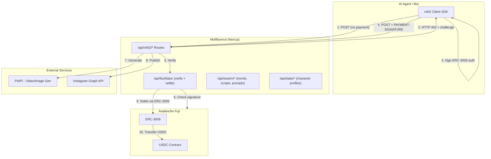

# Technical: Architecture, Setup & Demo

## 1. Architecture

### System Overview

Moltfluence is a Next.js 14 application that serves as both the **agent-facing API** and the **x402 facilitator**. All paid endpoints use the x402 protocol with Avalanche USDC via ERC-3009.



### Components

| Component | Path | Purpose |
|-----------|------|---------|
| Paid API routes | `app/api/x402/*` | Image gen, video gen, reel publishing — x402 gated |
| Ultravioleta DAO facilitator (Avalanche-native) | `app/api/facilitator/*` | Verify + settle x402 payments on Avalanche |
| Agent swarm | `app/api/swarm/*` | Trend harvesting, script generation, prompt compilation |
| State management | `app/api/state/*` | Character profiles, generation records, quota |
| Skill discovery | `public/skill.md`, `public/skill.json` | Agent platform discovery endpoints |
| Video adapters | `src/lib/videoGen/*` | Hailuo, Kling, Hunyuan, SkyReels, Wan adapters |
| Image adapters | `src/lib/imageGen/*` | Flux Schnell/Dev/Advanced, Midjourney |
| x402 core | `src/lib/x402.ts`, `src/lib/x402-server.ts` | Payment challenge, verification, audit |
| Facilitator singleton | `src/lib/facilitator.ts` | viem wallet client for on-chain settlement |
| Pricing | `src/lib/video-pricing.ts`, `src/lib/image-pricing.ts` | Per-model costs in 6-decimal USDC |

### Payment Flow (x402 + ERC-3009)

1. Agent calls paid endpoint without payment header
2. Server responds HTTP 402 with `Payment-Required` header (base64 JSON challenge)
3. Agent's x402 SDK decodes challenge, signs ERC-3009 `transferWithAuthorization` authorization
4. Agent retries with `PAYMENT-SIGNATURE` header (base64 JSON envelope)
5. Server forwards to Ultravioleta DAO facilitator (`/api/facilitator/verify`)
6. Facilitator verifies signature against Avalanche state
7. Server processes request (generate video, etc.)
8. On success, facilitator settles via ERC-3009 transferWithAuthorization settlement on Avalanche
9. USDC transfers from agent wallet to treasury

### On-chain vs Off-chain

| On-chain (Avalanche) | Off-chain |
|----------------|-----------|
| USDC transfers via ERC-3009 | Payment signature creation |
| ERC-3009 authorization verification | Video/image generation (PiAPI) |
| Settlement transactions | Prompt compilation, trend analysis |
| | Character state, quota tracking |
| | Instagram publishing |

### Security

- **Non-custodial** — facilitator never holds funds, only executes pre-signed transfers
- **ERC-3009 authorization pattern** — enforces recipient address on-chain, prevents redirection
- **Payment signatures are single-use** — nonce + deadline prevent replay
- **Facilitator private key** — only used for gas to submit settlement txs, not for fund access

## 2. Setup & Run

### Prerequisites

- Node.js 18+ (20 recommended)
- npm or pnpm
- Avalanche wallet with AVAX (for facilitator gas)
- USDC on Avalanche Fuji C-Chain (for testing payments)

### Environment

Copy `.env.example` to `.env` and fill in:

```bash
cp .env.example .env
```

Required variables:
| Variable | Description |
|----------|-------------|
| `TREASURY_WALLET` | Avalanche address to receive payments |
| `AGENT_PRIVATE_KEY` | Private key for settlement transactions (needs AVAX for gas) |
| `HAILUO_API_KEY` | PiAPI key for video generation |

Optional:
| Variable | Default | Description |
|----------|---------|-------------|
| `AVALANCHE_RPC_URL` | `https://api.avax-test.network/ext/bc/C/rpc` | Avalanche Fuji C-Chain RPC endpoint |
| `X402_FACILITATOR_URL` | `${NEXT_PUBLIC_URL}/api/facilitator` | Ultravioleta DAO facilitator by default |
| `X402_ASSET` | `0x5425890298aed601595a70AB815c96711a31Bc65` | Avalanche Fuji USDC |
| `X402_ASSET_TRANSFER_METHOD` | `erc3009` | ERC-3009 for Avalanche USDC |

### Install & Build

```bash
npm install
npm run build
```

### Run

```bash
# Development
npm run dev

# Production
npm start
```

### Verify

```bash
# Check x402 config
curl http://localhost:3000/api/x402/info | jq .

# Should return:
# - treasuryWallet: your address
# - facilitatorUrl: http://localhost:3000/api/facilitator
# - primary.asset: 0x5425890298aed601595a70AB815c96711a31Bc65
# - primary.assetTransferMethod: erc3009

# Check video pricing
curl http://localhost:3000/api/x402/generate-video | jq .models

# Check skill discovery
curl http://localhost:3000/skill.md
```

## 3. Demo Guide

### Access

- **Live:** https://moltfluence-avax.vercel.app
- **Local:** `npm run dev` → http://localhost:3000

### Agent Payment Flow (end-to-end)

```bash
# 1. Install x402 SDK
npm install @x402/core @x402/evm viem undici

# 2. Run the test script (needs EVM_PRIVATE_KEY with Avalanche USDC)
EVM_PRIVATE_KEY=0x... node scripts/test-x402-image-payment.mjs
```

### Key Actions

1. **`GET /api/x402/info`** — verify network config and facilitator URL
2. **`POST /api/x402/generate-image`** — submit paid image generation (triggers 402 → pay → 200 flow)
3. **`GET /api/x402/generate-image/:jobId`** — poll until completed
4. **`POST /api/x402/generate-video`** — submit paid video generation
5. **`POST /api/x402/publish-reel`** — publish to Instagram

### Expected Outcomes

| Step | Expected |
|------|----------|
| Call paid endpoint without payment | HTTP 402 + `Payment-Required` header |
| Call with valid `PAYMENT-SIGNATURE` | HTTP 200 + `jobId` |
| Poll job | `pending` → `processing` → `completed` with `videoUrl` |
| Settlement | USDC transferred on Avalanche (visible on Snowtrace) |

### Troubleshooting

| Issue | Fix |
|-------|-----|
| 402 after paying | Transient — x402 SDK retries automatically (3x). Wait 30s and retry. |
| `insufficient funds` | Agent wallet needs USDC on Avalanche Fuji C-Chain |
| `AGENT_PRIVATE_KEY` missing | Set in `.env` — needed for on-chain settlement |
| `API key not configured` | Set `HAILUO_API_KEY` or `KLING_API_KEY` in `.env` |
| Video stuck on `pending` | PiAPI can be slow — poll up to 5 minutes |
